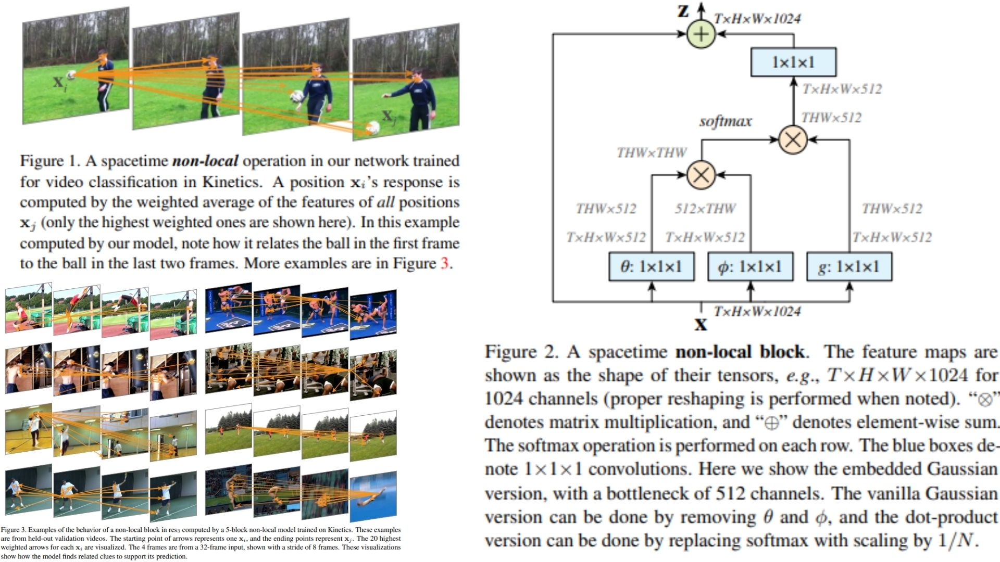

# 🌌 NonLocal-Replication – Spacetime Non-local Blocks for CNNs

This repository provides a **PyTorch-based replication** of  
**Non-local Neural Networks for Video and Image Understanding**.

The focus is **understanding and implementing spacetime non-local blocks** practically,  
rather than chasing benchmark SOTA results.

- Captures **long-range dependencies in space and time** ⏳  
- Modular & **plug-and-play for any CNN backbone** 🔗  
- Lightweight & interpretable, ideal for **experimentation** 🧩  

**Paper reference:** [Wang et al., 2018](https://arxiv.org/abs/1711.07971) 📄

---

## 🌠 Overview – Non-local Pipeline



The key idea:

> For each position in the feature map, compute a **weighted sum of all other positions**, enabling global context reasoning over space and time.

High-level procedure:

1. Extract feature map $X \in \mathbb{R}^{C \times T \times H \times W}$ from a CNN backbone.  
2. Compute **pairwise relation** using function $f$ between positions:  
   $$f(X_i, X_j)$$
3. Embed features using $g$:  
   $$g(X_j)$$
4. Aggregate weighted features for each position $i$:  
   $$Y_i = \sum_j \frac{f(X_i, X_j)}{\sum_j f(X_i, X_j)} g(X_j)$$
5. Transform with $1\times1\times1$ convolution and residual connection:  
   $$X'_i = X_i + W_z Y_i$$

The module can be inserted **after residual blocks** or at any intermediate CNN layer, and is fully **end-to-end trainable**.

---

## 🧮 Non-local Computation – Math Essentials

Given feature map $X$:

$$
Y_i = \sum_j \frac{f(X_i, X_j)}{\sum_j f(X_i, X_j)} g(X_j)
$$

Transform and fuse:

$$
X'_i = X_i + W_z Y_i
$$

Where:  
- $f$ = pairwise function (Gaussian, Embedded Gaussian, Dot-product, Concat)  
- $g$ = linear embedding function  
- $W_z$ = $1\times1\times1$ convolution for output projection  

### Optional Variants
- **Gaussian**: vanilla similarity  
- **Embedded Gaussian**: uses linear embeddings $\theta$, $\phi$  
- **Dot-product**: scaled dot-product  
- **Concat**: concatenation followed by linear projection  

This design captures **global dependencies efficiently** without requiring full self-attention.

---

## 🧠 What the Module Does

- Models **long-range space-time dependencies** across feature maps  
- Flexible: can use different $f$ functions depending on the task  
- Lightweight: adds minimal parameters for global reasoning  
- Fully **modular**, can attach to any CNN backbone

---

## 📦 Repository Structure

```bash
NonLocal-Replication/
├── src/
│   ├── layers/
│   │   ├── conv_layer.py          # Conv2d wrapper (1x1, 3x3, 3D conv)
│   │   ├── activation.py          # ReLU, Softmax helpers
│   │   └── normalization.py       # BatchNorm or LayerNorm
│   │
│   ├── nonlocal/
│   │   ├── nonlocal_block.py      # Non-local block implementation (Eq.1)
│   │   ├── f_functions.py         # f variants: gaussian, embedded, dot-product, concat
│   │   └── g_functions.py         # g representation function (linear embedding Wg)
│   │
│   ├── backbone/
│   │   └── resnet_blocks.py       # CNN block + optional non-local insertions
│   │
│   ├── model/
│   │   └── nonlocal_cnn.py        # Backbone + non-local forward logic
│   │
│   └── config.py                  # non-local positions, num_blocks, f_type, g_dim
│
├── images/
│   └── figmix.jpg                  # Non-local overview figure
│
├── requirements.txt
└── README.md
```
---


## 🔗 Feedback

For questions or feedback, contact: [barkin.adiguzel@gmail.com](mailto:barkin.adiguzel@gmail.com)
